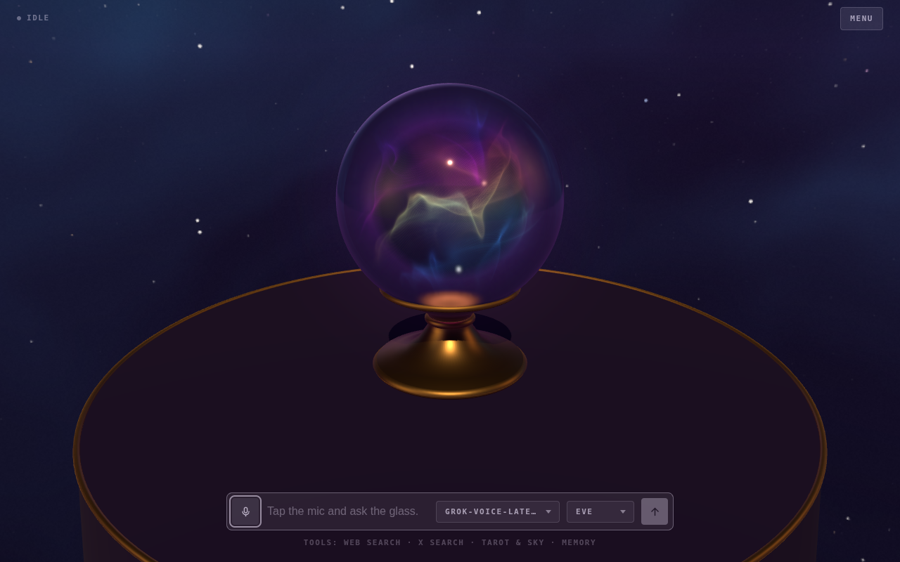
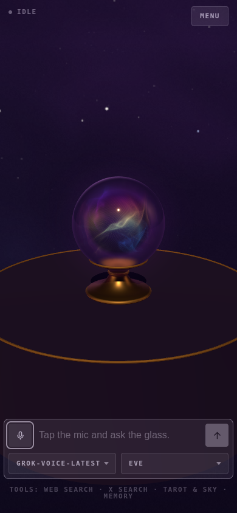

# Krystal

A voice agent rendered as a crystal ball — a fortune teller who lives in the
glass, with visions swirling inside her in every colour she has. She reads
tarot, casts horoscopes, knows what the moon is doing and what your sign says
about it, and runs on an xAI Grok speech-to-speech session in one of Grok's
women's voices.

The ball doesn't move. The visions do: a vortex of coloured mist that drifts
violet while she waits, turns teal while she listens, churns magenta while she
thinks and burns rose and gold while she talks — brighter and faster with her
voice. Talk over her and it clouds. Draw a card and the glass flares.

The cards are real. When she reads tarot she shuffles an actual 78-card deck and
lays out the spread — one card, past–present–future, or the full Celtic cross —
reversals and all, and reads what comes up rather than choosing it. She asks the
calendar for the date and the moon, searches the web or X for today's
horoscope, and remembers your sign between calls if you tell her to.

It's entertainment. Nothing here can see the future — see the
[AI Output Disclaimer](docs/ai-output-disclaimer.md).



<p align="center">
  
</p>

## Run

```sh
git clone https://github.com/h1ddenpr0cess20/krystal
cd krystal
npm install
cp .env.example .env      # add your XAI_API_KEY
npm run dev               # → http://localhost:5173
```

Click the mic, allow the browser's microphone prompt, and start talking. Ask her
for a reading.

Two pickers sit under the composer: the Grok voice model, and the voice — Eve,
Ara, Celeste, Luna, Carina, Iris, Lumen or Lux. Changing either redials and
keeps the conversation.

Tapping the mic is the microphone switch: turning it off stops what you send and
leaves the answer playing, and the conversation is still there when you turn it
back on. It also switches itself off after a minute of silence, and the call
survives that too. Holding the mic down is the hang-up — a ring closes around it
while you hold, and the call ends when it lands.

Drag on the view to walk round the table, wheel to lean in, right-drag to pan.

`menu`, in the top corner, is where the panels live: `tools`, `memory` and the
log, one row each. Picking a row closes the menu behind it.

`tools` has a switch for each tool she can reach for — web search, X search, the
tarot deck and the sky, and any MCP server the environment gave her. Switching
one off takes it out of the call already in progress, and it stays off in that
browser until you switch it back on.

The log keeps every conversation, and every spread she laid out in it, card by
card. `continue` on one picks it back up: the call is dialled again with those
turns handed over as context, and what you say from there lands in the same
entry rather than a new one.

| Script | |
|---|---|
| `npm run dev` | Vite, with the proxy mounted as middleware — one process |
| `npm run dev:lan` | The same, over HTTPS on the network — for a phone |
| `npm run build` | Bundles the client to `dist/` |
| `npm start` | Serves `dist/` with the same proxy in front |
| `npm run preview` | `build` then `start` |
| `npm run preview:lan` | `build` then `start`, over HTTPS on the network |
| `npm test` | `node:test`, against a stub xAI socket |
| `npm run lint` | ESLint |

CI runs the lint, the tests on Node 22.12 and 24, and a build that then has to
boot and serve itself over both HTTP and HTTPS. CodeQL scans the same source on
every push and again weekly, since its queries change faster than this does.

The ball is drawn with WebGPU where the browser has it and WebGL 2 where it does
not, by the small engine in `src/client/vendor/gfx/`; the visions are one shader
written for both. `?renderer=webgl` pins the fallback.

To run it on a phone, or in Docker, see
[configuration](docs/configuration.md#on-a-phone).

## Docs

- [**Configuration**](docs/configuration.md) — every environment variable, the
  HTTPS setup a phone needs for microphone access, Docker, and the tools — the
  tarot deck and the sky among them.
- [**Design notes**](docs/design.md) — how the call is wired, the audio path,
  what's in `localStorage`, the glass, how the visions are drawn, the moods, the
  source layout, and the seam another provider would have to implement.
- [**AI Output Disclaimer**](docs/ai-output-disclaimer.md) — what the model says
  is the model's, not the author's; fortune telling is entertainment; plus the
  risks that are specific to a live microphone and speech you hear before anyone
  can check it.
- [**Not a Companion**](docs/not-a-companion.md) — Krystal is a toy and a demo.
  She is not a friend, a therapist, a partner or an oracle, and the project will
  not grow in that direction.
